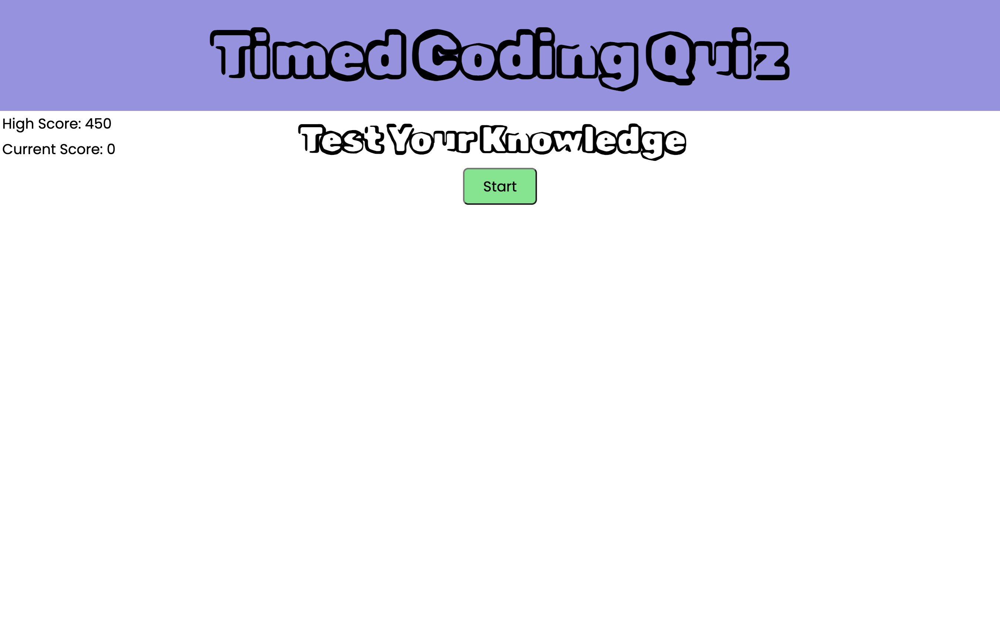
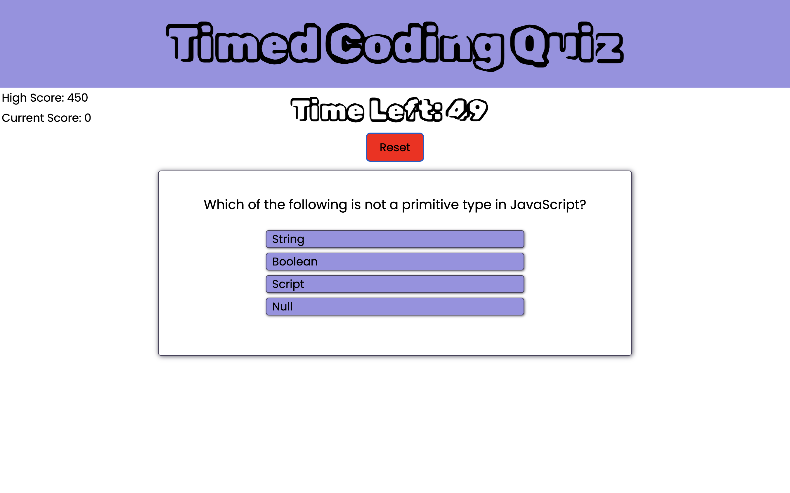
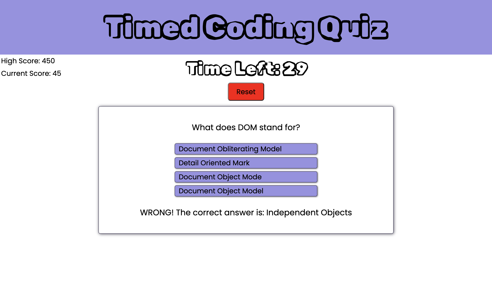
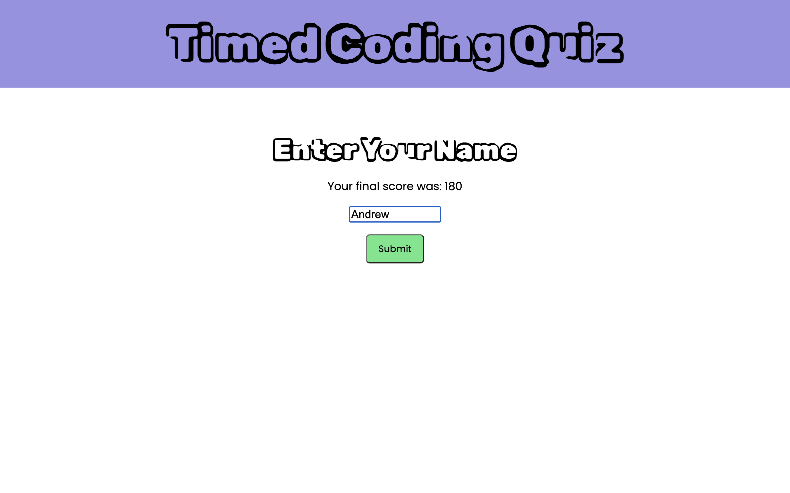
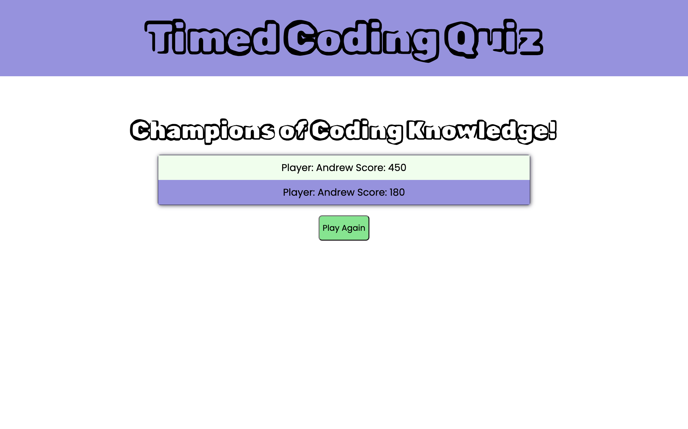

# Timed Code Quiz

## Project Intro

The goal of this project was to create a dynamic and responsive application where a user plays a timed, question-based game about JavaScript fundamentals. 

## Project Goals
```
1. Create an app with a polished UI that is responsive.
2. Within the app, create a timed, question-based game.
3. Keep score and increment based on right answers.
4. Remove time from the clock based on wrong answers.
5. Store the score and user name at the conclusion of the game.
6. Display the scores of all users.
```

## Landing Page

This is what the user will see upon first opening the app.



## Question Display

The user sees a timer at the top, a question prompt, and choices



## Answer Display

The user sees if the choice previously selected was right or wrong



# End of Game Display  

Once time has expired or all questions have been answered, the page asking for initials to be entered is displayed.



# High Scores Page

Once the user has entered their name, they will see their score and the scores of other users who have played the game.



## Live Site Link

[Live Site Link](https://andykb9b13.github.io/timed-code-quiz/)


